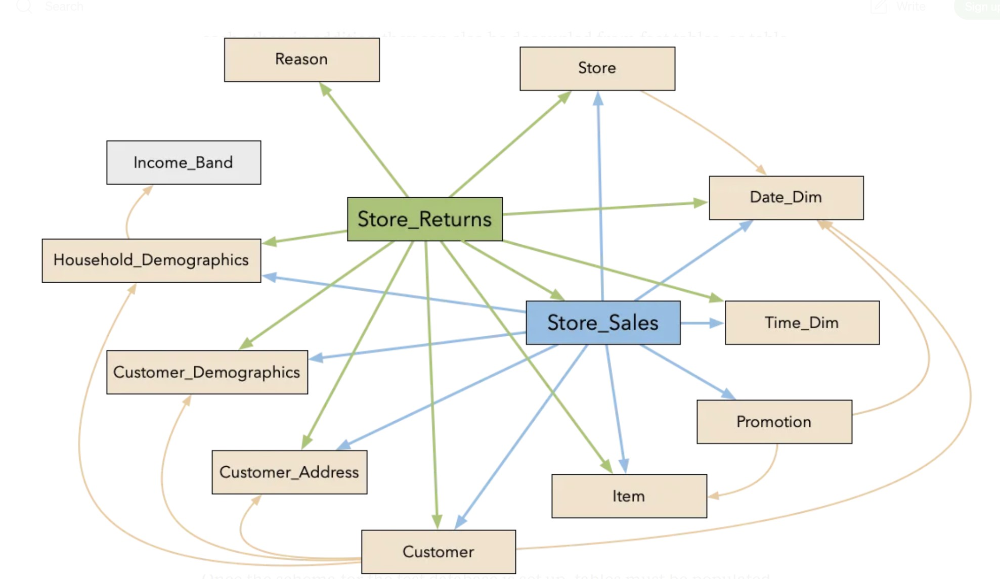

# Test Data Generator

Docker image to generate test data that is align to TPC-DS schema. Below are details to create the test data

```
docker build -t dsgen .
docker run --rm -v <<Data Location>>:/data/tpcds dsgen "dsdgen -SCALE 1 -DIR /data/tpcds -VERBOSE -TERMINATE N"
```

## TPC-DS Overview

The TPC-DS (Transaction Processing Performance Council Decision Support) benchmark, specifically using `dsdgen` Population Generator Version 2.10.0, employs a **snowflake schema**. This schema is designed to model the decision support functions of a retail product supplier across multiple channels.

The schema consists of **24 tables in total**: 7 fact tables and 17 dimension tables. These tables are organized around three primary sales channels (store, catalog, web) and an inventory system.

***

## TPC-DS Schema Overview (Version 2.10.0)

The schema is characterized by central **fact tables** that record business events (like sales and returns) and are linked to various **dimension tables** that provide context to these events (like information about customers, products, dates, etc.). The snowflake structure means that some dimension tables are further normalized into sub-dimensions.

### Core Table Categories:

* **Fact Tables (7):** These are the largest tables and store transactional data.
    * `STORE_SALES` (ss): Records sales made through physical stores.
    * `STORE_RETURNS` (sr): Records items returned to physical stores.
    * `CATALOG_SALES` (cs): Records sales made through catalogs.
    * `CATALOG_RETURNS` (cr): Records items returned from catalog purchases.
    * `WEB_SALES` (ws): Records sales made through the website.
    * `WEB_RETURNS` (wr): Records items returned from web purchases.
    * `INVENTORY` (inv): Tracks item inventory levels, primarily for catalog and web channels.
* **Dimension Tables (17):** These tables describe the attributes of the data in the fact tables.
    * **Date & Time:**
        * `DATE_DIM` (d): Detailed date information (year, month, day, day of the week, quarter, etc.). *Connected to all fact tables.*
        * `TIME_DIM` (t): Detailed time information (hour, minute, second). *Connected to sales and returns fact tables.*
    * **Customer & Demographics:**
        * `CUSTOMER` (c): Information about individual customers. *Connected to sales and returns fact tables.*
        * `CUSTOMER_ADDRESS` (ca): Addresses associated with customers. *Connected to `CUSTOMER`.*
        * `CUSTOMER_DEMOGRAPHICS` (cd): Demographic information about customers (gender, marital status, education). *Connected to `CUSTOMER`.*
        * `HOUSEHOLD_DEMOGRAPHICS` (hd): Demographic information about households (income band, number of vehicles). *Connected to `CUSTOMER` via `c_current_hdemo_sk` and also directly to sales/returns fact tables via `xxx_hdemo_sk`.*
    * **Item & Product:**
        * `ITEM` (i): Information about individual products/items. *Connected to all fact tables.*
    * **Promotion:**
        * `PROMOTION` (p): Information about sales promotions. *Connected to sales fact tables.*
    * **Store & Sales Channel Specific:**
        * `STORE` (s): Information about physical store locations. *Connected to `STORE_SALES` and `STORE_RETURNS`.*
        * `CATALOG_PAGE` (cp): Information about pages in a catalog. *Connected to `CATALOG_SALES`.*
        * `WEB_PAGE` (wp): Information about web pages on the e-commerce site. *Connected to `WEB_SALES`.*
        * `WEB_SITE` (web): Information about different web sites. *Connected to `WEB_PAGE`.*
    * **Reason for Return:**
        * `REASON` (r): Reasons why items are returned. *Connected to returns fact tables (`STORE_RETURNS`, `CATALOG_RETURNS`, `WEB_RETURNS`).*
    * **Shipping & Order Related:**
        * `SHIP_MODE` (sm): Information about shipping methods. *Connected to `CATALOG_SALES` and `WEB_SALES`.*
        * `WAREHOUSE` (w): Information about warehouses. *Connected to `INVENTORY`.*
        * `CALL_CENTER` (cc): Information about call centers. *Connected to `CATALOG_SALES`, `CATALOG_RETURNS`, `WEB_SALES`, `WEB_RETURNS`.*
    * `DBGEN_VERSION`: Contains information about the data generation version. Not typically part of analytical queries.

***

## Relationships Between Tables (Conceptual Diagram Description)


Visualizing the entire TPC-DS schema can be complex due to the number of tables and relationships. However, the core structure revolves around the fact tables connecting to multiple dimension tables via foreign key relationships, usually referencing the primary surrogate key (SK) of the dimension table.

A high-level textual representation of the relationships for the main sales and returns processes:

### 1. Store Sales & Returns Snowflake:

* **`STORE_SALES` (Fact)** connects to:
    * `DATE_DIM` (on `ss_sold_date_sk`)
    * `TIME_DIM` (on `ss_sold_time_sk`)
    * `ITEM` (on `ss_item_sk`)
    * `CUSTOMER` (on `ss_customer_sk`)
        * `CUSTOMER_ADDRESS` (indirectly via `CUSTOMER` on `c_current_addr_sk` or directly via `ss_addr_sk`)
        * `CUSTOMER_DEMOGRAPHICS` (indirectly via `CUSTOMER` on `c_current_cdemo_sk` or directly via `ss_cdemo_sk`)
        * `HOUSEHOLD_DEMOGRAPHICS` (indirectly via `CUSTOMER` on `c_current_hdemo_sk` or directly via `ss_hdemo_sk`)
    * `STORE` (on `ss_store_sk`)
    * `PROMOTION` (on `ss_promo_sk`)
* **`STORE_RETURNS` (Fact)** connects to:
    * `DATE_DIM` (on `sr_returned_date_sk`)
    * `TIME_DIM` (on `sr_return_time_sk`)
    * `ITEM` (on `sr_item_sk`)
    * `CUSTOMER` (on `sr_customer_sk`)
        * (and indirectly to customer related dimensions as above)
    * `STORE` (on `sr_store_sk`)
    * `REASON` (on `sr_reason_sk`)
    * (Often joined back to `STORE_SALES` via ticket number `sr_ticket_number = ss_ticket_number` and `sr_item_sk = ss_item_sk` for analyzing returns against sales)

### 2. Catalog Sales & Returns Snowflake:

* **`CATALOG_SALES` (Fact)** connects to:
    * `DATE_DIM` (on `cs_sold_date_sk` and `cs_ship_date_sk`)
    * `ITEM` (on `cs_item_sk`)
    * `CUSTOMER` (bill to: `cs_bill_customer_sk`, ship to: `cs_ship_customer_sk`)
        * `CUSTOMER_ADDRESS` (bill to: `cs_bill_addr_sk`, ship to: `cs_ship_addr_sk`)
        * `CUSTOMER_DEMOGRAPHICS` (bill to: `cs_bill_cdemo_sk`, ship to: `cs_ship_cdemo_sk`)
        * `HOUSEHOLD_DEMOGRAPHICS` (bill to: `cs_bill_hdemo_sk`, ship to: `cs_ship_hdemo_sk`)
    * `PROMOTION` (on `cs_promo_sk`)
    * `CATALOG_PAGE` (on `cs_catalog_page_sk`)
    * `SHIP_MODE` (on `cs_ship_mode_sk`)
    * `WAREHOUSE` (on `cs_warehouse_sk`)
    * `CALL_CENTER` (on `cs_call_center_sk`)
* **`CATALOG_RETURNS` (Fact)** connects to:
    * `DATE_DIM` (on `cr_returned_date_sk`)
    * `ITEM` (on `cr_item_sk`)
    * `CUSTOMER` (on `cr_returning_customer_sk`)
        * `CUSTOMER_ADDRESS` (on `cr_returning_addr_sk`)
        * `CUSTOMER_DEMOGRAPHICS` (on `cr_returning_cdemo_sk`)
        * `HOUSEHOLD_DEMOGRAPHICS` (on `cr_returning_hdemo_sk`)
    * `REASON` (on `cr_reason_sk`)
    * `CATALOG_PAGE` (on `cr_catalog_page_sk`)
    * `CALL_CENTER` (on `cr_call_center_sk`)
    * (Often joined back to `CATALOG_SALES` via order number `cr_order_number = cs_order_number` and `cr_item_sk = cs_item_sk`)

### 3. Web Sales & Returns Snowflake:

* **`WEB_SALES` (Fact)** connects to:
    * `DATE_DIM` (on `ws_sold_date_sk` and `ws_ship_date_sk`)
    * `TIME_DIM` (on `ws_sold_time_sk`)
    * `ITEM` (on `ws_item_sk`)
    * `CUSTOMER` (bill to: `ws_bill_customer_sk`, ship to: `ws_ship_customer_sk`)
        * `CUSTOMER_ADDRESS` (bill to: `ws_bill_addr_sk`, ship to: `ws_ship_addr_sk`)
        * `CUSTOMER_DEMOGRAPHICS` (bill to: `ws_bill_cdemo_sk`, ship to: `ws_ship_cdemo_sk`)
        * `HOUSEHOLD_DEMOGRAPHICS` (bill to: `ws_bill_hdemo_sk`, ship to: `ws_ship_hdemo_sk`)
    * `PROMOTION` (on `ws_promo_sk`)
    * `WEB_PAGE` (on `ws_web_page_sk`)
        * `WEB_SITE` (indirectly via `WEB_PAGE` on `wp_web_site_sk`)
    * `SHIP_MODE` (on `ws_ship_mode_sk`)
    * `WAREHOUSE` (on `ws_warehouse_sk`)
* **`WEB_RETURNS` (Fact)** connects to:
    * `DATE_DIM` (on `wr_returned_date_sk`)
    * `TIME_DIM` (on `wr_return_time_sk`)
    * `ITEM` (on `wr_item_sk`)
    * `CUSTOMER` (on `wr_returning_customer_sk`)
        * `CUSTOMER_ADDRESS` (on `wr_returning_addr_sk`)
        * `CUSTOMER_DEMOGRAPHICS` (on `wr_returning_cdemo_sk`)
        * `HOUSEHOLD_DEMOGRAPHICS` (on `wr_returning_hdemo_sk`)
    * `REASON` (on `wr_reason_sk`)
    * `WEB_PAGE` (on `wr_web_page_sk`)
    * (Often joined back to `WEB_SALES` via order number `wr_order_number = ws_order_number` and `wr_item_sk = ws_item_sk`)

### 4. Inventory Fact Table:

* **`INVENTORY` (Fact)** connects to:
    * `DATE_DIM` (on `inv_date_sk`)
    * `ITEM` (on `inv_item_sk`)
    * `WAREHOUSE` (on `inv_warehouse_sk`)

***

## Visual Diagram Resources:

For a graphical representation, you can refer to:

1.  **The official TPC-DS Specification Document:** The specification for version 2.10.0 (and other versions) typically includes detailed entity-relationship diagrams. You can find this on the TPC website (tpc.org). The specific link for v2.10.0 is:
    [TPC-DS v2.10.0 Specification PDF](https://www.tpc.org/tpc_documents_current_versions/pdf/tpc-ds_v2.10.0.pdf) (See Clause 2 for the logical schema).
2.  **Online Resources and Academic Papers:** Many database vendors, researchers, and data professionals publish diagrams of the TPC-DS schema. A search for "TPC-DS schema diagram" often yields useful visual aids. For instance, the ResearchGate link:
    [TPC-DS data warehouse schema on ResearchGate](https://www.researchgate.net/figure/TPC-DS-data-warehouse-schema_fig2_314508757) shows an example, though you'd want to cross-reference it with the v2.10.0 specification for full accuracy.

***

The key takeaway is that each fact table acts as a central hub, linked via surrogate keys (like `_sk`) to various dimension tables that provide descriptive attributes for the transactional data.